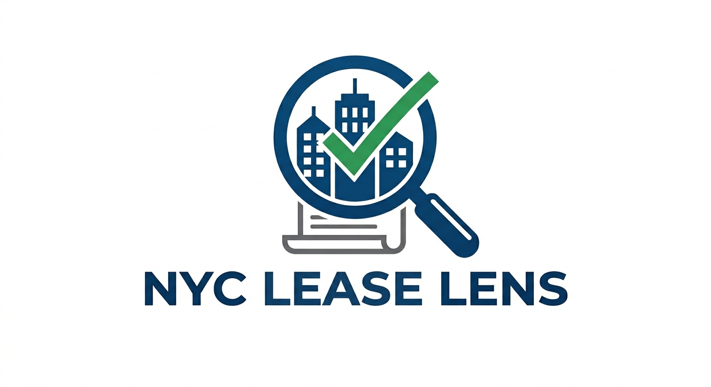
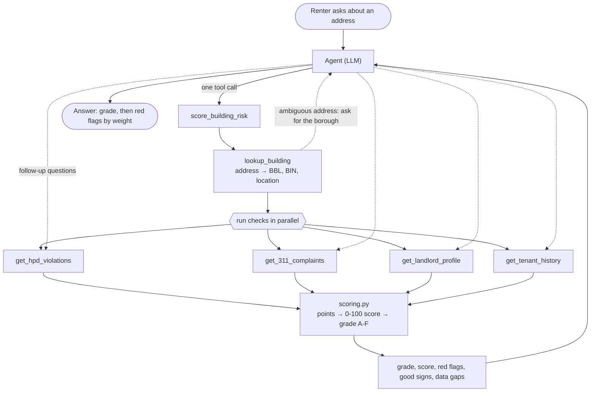

<p align="center">
  
</p>

# NYC Lease Lens

[](https://github.com/alex-is-busy-coding/nyc-lease-lens/actions/workflows/ci.yml)

An AI agent that checks any NYC apartment for red flags before you sign the lease.

## Quickstart

Requires [uv](https://docs.astral.sh/uv/) and the [gcloud CLI](https://cloud.google.com/sdk/docs/install) (`brew install --cask google-cloud-sdk`).

```bash
make setup   # create .env, install deps, log in to Google Cloud, enable Vertex AI
make dev     # start with auto-reload at http://127.0.0.1:8000
```

Config lives in `.env` (copied from `.env.example`, gitignored).
Override any value per call, e.g. `make dev PORT=9000`.

## How it works

Give the agent an address and it makes one call to `score_building_risk`. That tool identifies the building, runs every check against NYC Open Data at the same time, and passes the results to `scoring.py`, which turns them into a grade. The agent then explains the grade, and can call any check on its own for follow-up questions.

The diagram is generated from the code; `make docs` refreshes it.

<!-- flow:start -->

<!-- flow:end -->

### How the grade works

Each red flag adds points, and the total is capped at 100:

- **Severity first.** Signs that tenants are forced out or mistreated weigh the most: vacate orders, harassment findings and court-appointed administrators. Hazardous (class C) and rent-impairing violations come next.
- **Per apartment.** Violations and evictions are counted per 100 apartments, so a big building isn't penalized for its size. Small counts are capped, so one old violation in a small building can't outweigh hundreds in a large one.
- **Compared with neighbors and the city.** 311 complaints are ranked against nearby buildings, and the landlord's portfolio against the citywide violation rate.
- **Recent over old.** Harassment findings and court-appointed administrators count for less after ten years.
- **Good signs and gaps.** Clean results are listed as good signs. If a check fails, the report says so, because a missing check can only make the score look better than it is.

<!-- grades:start -->
| Grade | Score |
| --- | --- |
| A | 0–9 |
| B | 10–24 |
| C | 25–44 |
| D | 45–69 |
| F | 70–100 |
<!-- grades:end -->

The exact weights are in [src/nyc_lease_lens/scoring.py](src/nyc_lease_lens/scoring.py).

## Data

Every fact comes from public City of New York records, fetched live when you ask; the app stores none of it. No account or API key is needed for any of these datasets.

Most of the data comes from HPD, the city's Department of Housing Preservation and Development. The table is generated from [src/nyc_lease_lens/datasets.py](src/nyc_lease_lens/datasets.py) and the datasets each tool declares; `make docs` refreshes it.

<!-- data:start -->
| Dataset | Published by | Updated | What we use it for | Read by |
| --- | --- | --- | --- | --- |
| [NYC GeoSearch](https://geosearch.planninglabs.nyc/) | Department of City Planning | Quarterly | Turning an address into a BBL, BIN and coordinates | `lookup_building` |
| [Primary Land Use Tax Lot Output (PLUTO)](https://data.cityofnewyork.us/d/64uk-42ks) | Department of City Planning | Quarterly | Year built, floors, units and owner of record for each tax lot | `lookup_building`, `get_311_complaints` |
| [Buildings Subject to HPD Jurisdiction](https://data.cityofnewyork.us/d/kj4p-ruqc) | HPD | Monthly | Legal apartment counts per building | `lookup_building`, `get_311_complaints`, `get_landlord_profile` |
| [Housing Maintenance Code Violations](https://data.cityofnewyork.us/d/wvxf-dwi5) | HPD | Daily | Violations by severity class and type, and old lot numbers after renumbering | `get_hpd_violations`, `get_311_complaints`, `get_landlord_profile`, `get_tenant_history` |
| [311 Service Requests from 2020 to Present](https://data.cityofnewyork.us/d/erm2-nwe9) | 311 | Daily | Complaints about the building and its neighbors | `get_311_complaints` |
| [Multiple Dwelling Registrations](https://data.cityofnewyork.us/d/tesw-yqqr) | HPD | Monthly | Whether the building is registered, and the buildings in a landlord's portfolio | `get_landlord_profile` |
| [Registration Contacts](https://data.cityofnewyork.us/d/feu5-w2e2) | HPD | Monthly | Owner, head officer and managing agent, used to link a landlord's buildings | `get_landlord_profile` |
| [Buildings Selected for the Alternative Enforcement Program (AEP)](https://data.cityofnewyork.us/d/hcir-3275) | HPD | Monthly | Which of a landlord's buildings are among the city's worst-maintained | `get_landlord_profile` |
| [Evictions](https://data.cityofnewyork.us/d/6z8x-wfk4) | Department of Investigation | Daily | Residential evictions carried out by city marshals | `get_tenant_history` |
| [Bedbug Reporting](https://data.cityofnewyork.us/d/wz6d-d3jb) | HPD | Monthly | Owners' annual bedbug reports, and missing ones | `get_tenant_history` |
| [Housing Litigations](https://data.cityofnewyork.us/d/59kj-x8nc) | HPD | Monthly | Housing court cases, harassment findings and court-appointed administrators | `get_tenant_history` |
| [Order to Repair/Vacate Orders](https://data.cityofnewyork.us/d/tb8q-a3ar) | HPD | Daily | Orders forcing tenants out of unsafe apartments or buildings | `get_tenant_history` |
<!-- data:end -->

### What gets sent where

- **The address you type** goes to NYC GeoSearch to find the building. The checks then query NYC Open Data (data.cityofnewyork.us) by the building's IDs and coordinates.
- **Your messages and the check results** go to the language model (Gemini on Google Vertex AI by default) so it can write the answer.
- **Conversations** are kept only in the server's memory. They are gone when you press Clear or the server restarts. At the default log level, the logs record timings and grades, not your messages or addresses.

### Limits of the data

- **It's only as current as the city's updates.** Some datasets update daily, others monthly or quarterly (see the table). New landlord registrations, for example, can be missing for a month or more.
- **Records show what was reported, not what is true today.** A violation can be fixed but not yet closed, and a 311 complaint is a report, not a confirmed problem.
- **Records are matched by tax lot.** One lot can hold several buildings, in which case the counts cover all of them. When a lot has been renumbered, its records under the old number are included.
- **Landlord portfolios are linked by name.** Buildings are grouped by the head officer's name and office ZIP, or by the managing agent's company name. This can occasionally group different people who share a name, or miss buildings registered under other names.
- **This is information, not legal advice.** For help with a landlord, contact 311 or a tenant organization.

## Make targets

Run `make help` prints the same list.

<!-- make:start -->
| Target | What it does | Runs first |
| --- | --- | --- |
| `make help` | Show this help | — |
| `make setup` | First-time setup: .env, deps, gcloud login, enable Vertex AI | `env`, `install`, `login`, `gcp-setup` |
| `make env` | Create .env from .env.example | — |
| `make install` | Install dependencies from uv.lock and the git pre-commit hooks | `.env` |
| `make login` | Log in to Google Cloud and point ADC at the project | `require-gcloud` |
| `make gcp-setup` | Enable the Vertex AI API on the project | `require-gcloud` |
| `make auth-check` | Verify credentials work before starting the app | `require-gcloud` |
| `make run` | Start the app | `.env`, `auth-check` |
| `make dev` | Start the app with auto-reload | `.env`, `auth-check` |
| `make lint` | Lint and check formatting with ruff | — |
| `make format` | Auto-format and fix lint issues with ruff | — |
| `make typecheck` | Type-check with mypy | — |
| `make check` | Run every pre-commit hook on all files | — |
| `make docs` | Regenerate the make targets and tools tables in README.md | — |
| `make clean` | Remove the virtualenv and caches | — |
<!-- make:end -->

## Tools

The agent calls these tools to check a building. The table is generated from `src/nyc_lease_lens/tools/`; run `make docs` to refresh it.

<!-- tools:start -->
| Tool | What it does | Parameters |
| --- | --- | --- |
| `score_building_risk` | Check an NYC building end to end and grade it from A (no red flags) to F. | `address` (string, required): Street address, e.g. '157 Ludlow St'<br>`borough` (string, optional): Borough, if the user mentioned it or it is clear from context. One of: `Manhattan`, `Bronx`, `Brooklyn`, `Queens`, `Staten Island`. |
| `lookup_building` | Identify an NYC building from a street address. | `address` (string, required): Street address, e.g. '157 Ludlow St' or '89-11 Queens Blvd'<br>`borough` (string, optional): Borough, if the user mentioned it or it is clear from context. One of: `Manhattan`, `Bronx`, `Brooklyn`, `Queens`, `Staten Island`. |
| `get_hpd_violations` | Summarize HPD housing code violations for a building, by severity class and type (pests, mold, heat/hot water, lead paint, fire safety, illegal occupancy, ...). | `bbl` (string, required): 10-digit BBL from lookup_building<br>`months` (integer, optional, 1–120): How far back to count violations, open or closed. Default 36. |
| `get_311_complaints` | Summarize 311 complaints about a building (heat/hot water, pests, mold, leaks, noise, sanitation, repairs) and compare it with nearby buildings per apartment, as a percentile: 90 means more complaints per unit than 90% of nearby buildings. | `bbl` (string, required): 10-digit BBL from lookup_building<br>`latitude` (number, optional): Building latitude from lookup_building<br>`longitude` (number, optional): Building longitude from lookup_building<br>`categories` (string[], optional): Only report these categories. Omit for all. One of: `heat_hot_water`, `pests`, `mold`, `leaks_plumbing`, `noise`, `sanitation`, `repairs`.<br>`radius_m` (integer, optional, 50–500): Radius in meters for the nearby-building comparison. Default 150.<br>`months` (integer, optional, 1–60): How far back to count complaints. Default 24. |
| `get_landlord_profile` | Identify the building's registered owner, head officer and managing agent from HPD registrations, and summarize their portfolios: how many buildings and apartments they control, open class C (immediately hazardous) violations per 100 apartments compared with the citywide rate, buildings in the city's Alternative Enforcement Program for the worst-maintained buildings, and their worst buildings. | `bin` (string, required): 7-digit BIN from lookup_building |
| `get_tenant_history` | Summarize what has happened to tenants in a building: executed residential evictions by year, the owner's annual bedbug reports, HPD housing court cases (tenant repair actions, harassment, heat, false repair certifications, court-appointed 7A administrators), harassment findings, and vacate orders that forced tenants out. | `bbl` (string, required): 10-digit BBL from lookup_building<br>`years` (integer, optional, 1–20): How far back to count evictions and court cases. Harassment findings and 7A administrators are reported from any year. Default 5. |
<!-- tools:end -->

## Contributing

See [CONTRIBUTING.md](CONTRIBUTING.md) for setup, the commit checks and commit message format, and how to add a tool.

## License

This project is licensed under the MIT License. See the [LICENSE](LICENSE) file for details.
